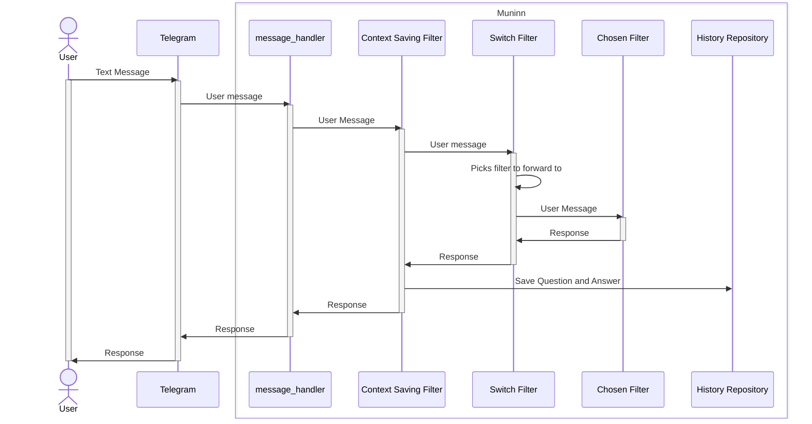

# System Overview

## Capabilities

Once the message has been received from a bot interface such as the Telegram library, it is then transformed to a `RequestMessage`. These messages are then passed between a special type of class called a [`Capability`](../filters/filter_types.py). Capabilities either process a message and return a `ResponseMessage`, or pass the message on to another `Filter`, which will then return an `ResponseMessage` back to its caller once it is done.

Capabilities implement an interface that allow the system to treat them all the same way. All capabilities need to provide the following functionality 

### `description`
Since we are dealing with a system that fundamentally runs off of language models, one feature is that a filter can use the description of another filter to help it decide what to do. For example, if a filter is trying to decide whether to process a message, it can use the description of another filter to help it decide. For this to work filters need to provide a description of what they do.

### `relevance_to`
A capability can implement this method to inform the system how relevant it is to a particular message. This is especially useful for filters that are waiting for a user response and may want to make themselves prioritised over other filters in certain situations. 

### `process`
This is the main method of a filter. It takes a `RequestMessage` and returns a `ResponseMessage`. The text of the `ResponseMessage` is then saved by the Context Saving Filter and passed back to the bot interface.

# Performance considerations
One potential improvement would be to use the actor model for filters. Possible implementations in Python include Pykka and [Ray](https://docs.ray.io/en/latest/ray-core/actors.html). 

