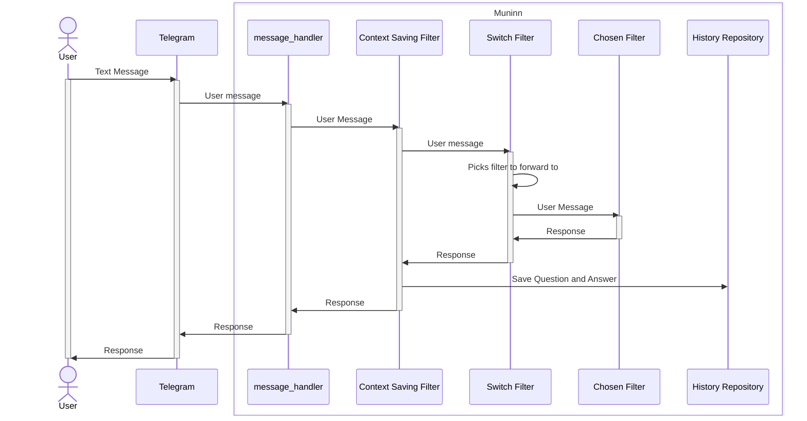

```mermaid
sequenceDiagram
    actor User

    participant Telegram

    box Muninn
    participant message_handler
    participant Context Saving Filter
    participant Switch Filter
    participant Chosen Filter
    participant History Repository
    end
   

    User->>Telegram: Text Message
    activate User

    activate Telegram
    Telegram->>message_handler: User message

    activate message_handler
    message_handler->>Context Saving Filter: User Message

    activate Context Saving Filter
    Context Saving Filter->>Switch Filter: User message

    activate Switch Filter
    Switch Filter->>Switch Filter: Picks filter to forward to
    Switch Filter->>Chosen Filter: User Message

    activate Chosen Filter
    Chosen Filter->>Switch Filter: Response
    deactivate Chosen Filter
    
    Switch Filter->>Context Saving Filter: Response
    deactivate Switch Filter
 
    Context Saving Filter->>History Repository: Save Question and Answer
    Context Saving Filter->>message_handler: Response
    deactivate Context Saving Filter

    message_handler->>Telegram: Response
    deactivate message_handler
    

    Telegram->>User: Response
    deactivate Telegram
    deactivate User

```